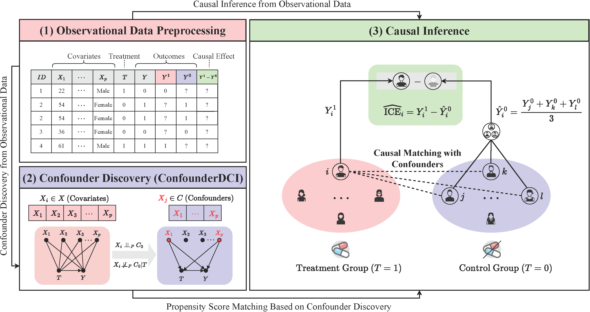

# ConfounderDCI

This is the official implementation of the paper **"[ConfounderDCI]()"**

## Overview

In this paper, we propose ConfounderDCI, a novel constraint-based approach for discovering confounders from observed data. The figure below exhibits the overall framework of our ConfounderDCI.



## Project directory structure

<!-- Put the following code into the URL (https://devtool.tech/tree) for rendering
```sh
+ confounderDCI-codes
  + data
    + nc3_nIter20
  + utils
    + data_generator.m
    + evaluation.m
  + models
    + confounderDCI
      + KCI
      + confounderDCI.m     # algorithm function
  + results
    + confounderDCI
      + nc3_nIter20
  + main_data_generation.m  # generate data based on the structural causal model
  + main_confounderDCI.m    # discover confounders using confounderDCI
  + README.md
``` -->

```sh
confounderDCI-codes
├── data
│   └── nc3_nIter20
├── utils
│   ├── data_generator.m
│   └── evaluation.m
├── models
│   └── confounderDCI
│       ├── KCI
│       └── confounderDCI.m  # algorithm function
├── results
│   └── confounderDCI
│       └── nc3_nIter20
├── main_data_generation.m   # generate data based on the structural causal model
├── main_confounderDCI.m     # discover confounders using ConfounderDCI
└── README.md
```

## How to Run

- Experimental environment: Matlab 2022a
- Evaluation: quick start

```sh
main_data_generation.m       # generate data based on the structural causal model
main_confounderDCI.m         # discover confounders using confounderDCI
```

## Acknowledgements

We would like to express our sincere gratitude to the related works and open-source codes that have served as inspiration for our project:

- Causality package. [[GitHub](https://github.com/akelleh/causality)]
- Causal-learn package. [[GitHub](https://github.com/py-why/causal-learn)]
- Dowhy package. [[GitHub](https://github.com/py-why/dowhy)]

- A. Mastakouri, B. Schölkopf, and D. Janzing. Selecting causal brain features with a single conditional independence test per feature. Advances in Neural Information Processing Systems, 32, 2019. [[Paper](https://proceedings.neurips.cc/paper_files/paper/2019/file/e6be4c22a5963ab00dfe8f3b695b5332-Paper.pdf)] [[Code](https://gitlab.tuebingen.mpg.de/amastakouri/singleCICausalFeatureSelection)]

- A. Wu, J. Yuan, K. Kuang, B. Li, R. Wu, Q. Zhu, Y. Zhuang, and F. Wu. Learning decomposed representations for treatment effect estimation. IEEE Transactions on Knowledge and Data Engineering, 35(5):4989–5001, 2022. [[Paper](https://ieeexplore.ieee.org/document/9712445)] [[Code](https://github.com/anpwu/DeR-CFR)]

- K. Zhang, J. Peters, D. Janzing, and B. Schölkopf. Kernel-based conditional independence test and application in causal discovery. arXiv preprint arXiv:1202.3775, 2012. [[Paper](https://arxiv.org/abs/1202.3775)] [[Code](http://people.tuebingen.mpg.de/kzhang/KCI-test.zip)]

And we also extend our sincere gratitude to the authors of the baseline methods for generously sharing their source codes publicly:

- L. Song, A. Smola, A. Gretton, J. Bedo. and K. Borgwardt. Feature Selection via Dependence Maximization. Journal of Machine Learning Research, 13(5), 2012. [[Paper](https://jmlr.csail.mit.edu/papers/volume13/song12a/song12a.pdf)] [[Code](https://github.com/ericstrobl/MarkovBlanket)]

- M. Yamada, W. Jitkrittum, L. Sigal, E. P. Xing, and M. Sugiyama. High-dimensional feature selection by feature-wise kernelized lasso. Neural computation, 26(1):185–207, 2014. [[Paper](https://arxiv.org/pdf/1202.0515)] [[Code](https://github.com/riken-aip/pyHSICLasso)]
